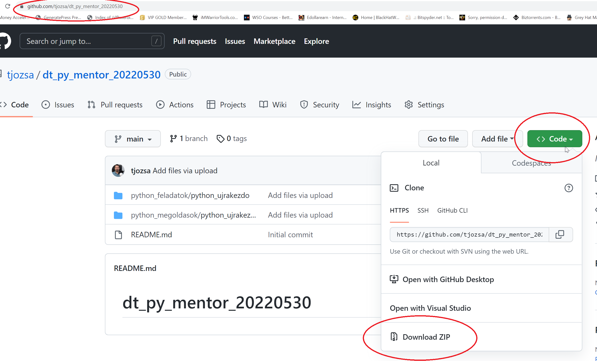

# Hogyan metsd le a feladatokat?
A lehető leg egyszerűbb módon:

Miután letöltötted a zip file-t tömörítsd ki a tartalmát egy munka könyvtárba. 

# Munkafüzet futtatás lehetőségek
Ez a repo jupyter notebook munkafüzeteket tartalmaz. Ezek olyan - jellemzően python - programozási nyelven íródott kódcellákat és dokumentációs cellákat tartalmaznak. Futtatásuk több módon is lehetséges.

## Online bármely erre szakosodott munkafüzet szolgáltatáson
Fel tudod tölteni egy web böngésző segítségével egy olyan online szolgátatásra ami képes online futtatni a munkafüzeteket. Az általunk jelenleg javasolt szolgáltatás [Jetbrains Datalore](https://datalore.jetbrains.com/notebooks).

## Saját gépre telepített környezettel
Abban az esetben ha már van python környezeted telepítve a gépedre akkor fel tudod telepíteni a jupyter notebook csomagot.

```
pip install ipykernel
```

majd

```
pip install jupyterlab
```

Ezek után parancssorból már tudod futtatni a jupyter lab környezetet:


```
pip install notebook
```

Ezek után a böngészödben már lokálisan el fogod tudni érni a futó jupyter szervert:


Már csak be kell dobálnod a munkafüzeteket és egyesével meg tudod őket nyitni. (Egy tipp: ha abból a mappából indítod el a jupyter lab szervert ahova letöltötted és kicsomagoldtad a munkafüzeteket akkor nem kell megnyitogatnod őket).
